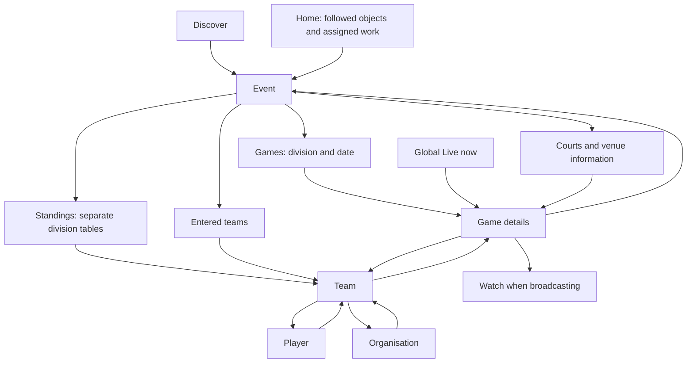

# Connected GUI plan

Status: planned, 2026-09-07. The user redirected the approved event-page work
into this broader plan before implementation. Existing event/header/CSS edits
belong to the earlier layout pass and are preserved. This document owns the
navigation and information-architecture work; the [domain register](2026-09-07-01-react-domain-coverage.md)
still owns GAP-05–08 coverage and permission acceptance.

## Outcome

A reader can find an event, choose a division, open a game, visit either team
and a player, then return to the same event view without starting again.
A coach, organiser or referee uses those same objects with the actions the
server permits. The GUI should expose relationships, not just individual tables.

## Evidence and current breaks

This is a focused source and signed-out local-browser review, not a full role,
phone or production audit. Earlier in this session, Overview, Schedule and
Standings were inspected at `/#/event/evt_002`. During this planning pass,
`/#/team/team_001` was inspected and its Roster link was activated: the URL
became `#roster` and the page displayed “That page does not exist.” The browser
was returned to the event page afterwards. Normal pointer clicks timed out;
DOM activation verified the destination only, not pointer usability. No app
tests were run for this documentation-only pass.

| Break | Evidence | Consequence |
| --- | --- | --- |
| Event context disappears | `pages/event.tsx` holds the tab in `useState`; `lib/router.tsx` already supports query state | Sharing/reloading cannot reproduce a tab; locale remount resets it |
| Section links collide with routing | Team Roster reproduces the not-found page; Schedule uses the same raw-hash pattern | Basic movement within a team leaves the team |
| Event game links go elsewhere | Overview's schedule link and non-broadcast game rows go to global Live | The selected event/game is lost |
| No general game destination | Router has watch/broadcast but no game page; Schedule opens video only when available | A fixture without video has no consistent detail destination |
| Related entities are dead ends | Event Entries and Standings render team names as text; team organisation is text; team fixtures are static rows | Readers must search directories to continue |
| Rankings cross divisions | `api/standings.ts` globally sorts entries and calculates previous ranks globally | Unrelated competitions receive one misleading ranking |
| Counts/results disagree in meaning | `useTeamGames` derives wins from any non-null score; event progress now uses FINISHED | A live lead can count as a team win |
| Court view loses information | `components/court-board.tsx` stores one live game per venue and overwrites earlier matches; no game links | Simultaneous live fixtures can disappear from this view |
| Repeated views diverge | Overview, Schedule, Live, team fixtures and Courts format overlapping game data separately | Ordering, spoiler handling, status and navigation vary by page |

## Proposed map

Arrows describe navigation, not ownership. A team participates in multiple
events; it must not be made a permanent child of whichever event opened it.
An event-scoped division is a view of participation, not a new global directory.

Keep global Discover, Live, Teams and Organisations. These are entry points,
not places a contextual action should unexpectedly send someone. Home remains
the signed-in entry to followed objects and assigned work; reuse the existing
home surface rather than add a competing dashboard.

## Navigation and presentation contract

- Give each object a stable URL. Use native links for navigation and buttons
  for actions; allow opening links in another tab and sharing the current view.
- Keep event tab, division and relevant date/team filters in validated query
  state. Proposed example: `#/event/evt_002?tab=games&division=ID`.
  Selected filters survive Games → Standings → Teams, reload and locale changes.
  “All divisions” means separate tables, never one combined ranking.
- Add `#/game/ID` as the common destination for fixtures, results, live games,
  court matches and notifications. Keep existing watch/broadcast URLs working.
  Opening a game shows details; Watch is an explicit action when available.
- Browser Back restores the originating filtered view and scroll position.
  Breadcrumbs describe the object's relationships, not a made-up hierarchy.
  A direct game link has a valid event link even without navigation history.
- Route section selection through the existing router, e.g.
  `#/team/ID?section=roster`; never replace the application hash with an anchor.
  Validate unknown tabs, invalid filters and missing objects with recoverable UI.
- Use one game summary presentation and shared status/time/result logic in
  event, team, Live and court views. Only FINISHED games contribute to records.
  Respect spoiler mode wherever scores or outcomes are exposed. Show event
  and division context when a list spans events; label aggregate team records.
- Group event navigation around Games, Standings, Teams, Places and About.
  Places connects court activity with venue address/details. About contains
  rules and event information. Division selection sits above competition views.
  Put division setup and other permitted edits in a discoverable Manage area;
  keep immediate game actions beside the game, gated by existing `can` values.
- Adapt to event type: camps lead with Sessions and Players; do not add league
  standings to a camp. Preserve current showcase/tournament capabilities.
- Compact the header to identity, dates/location, status and the relevant
  primary action. Put detailed counts in their respective views. On a phone,
  the primary game/session content should appear without scrolling past a
  dashboard-sized header. Preserve readable names and usable touch targets.

## Implement in this order

Each step includes its checks and a docs update before the next step. Reuse
the existing router, data hooks, permission components and automation scripts.

### 1. Repair navigation and give games a destination

Fix team section URLs. Move event tab/filter state into the router. Add a
game-detail route with event, division, teams, start time/timezone, assigned
venue, status, score visibility and conditional Watch. Preserve existing
score-entry/referee/broadcast permissions; do not duplicate role rules.
Audit whether the existing game API can resolve a single ID efficiently;
extend the shared API if necessary rather than fetch every game's data.

Wire event game links and team fixtures to that destination. Keep the event
and return context. This is the first reviewable slice: event → game → team
→ roster → player → Back, including a game without a broadcast.

### 2. Make the competition views agree

Replace Overview and Schedule with Games: LIVE/HALF_TIME first, upcoming games
in start order, results newest first. Include scheduled dates/times and venue
TBC states; do not hide cancelled/postponed games if supported by the vocabulary.
Preserve fixture creation, generation, assignment, scoring and game stats.

Use event-entry division IDs, never infer age/gender from team names. Validate
both participants' membership; flag inconsistent data rather than guess a
division. Rank and calculate previous movement inside each division at the API
layer. Preserve established competition scoring rules; explicitly test ties,
unplayed teams and null-division entries. Audit the existing movement time
window and label its meaning accurately instead of claiming stored history.
Fix team records to count completed games only.

### 3. Connect the remaining relationships

Link event entries and standings to teams, players back to teams, teams to
their organisation, and each cross-event fixture to its event/game. Reuse
existing organisation → team and roster → player paths. Supply missing IDs
through typed API data where necessary; never navigate by display name.

Connect venue details to court activity and game rows. Audit whether a venue
represents a court or a multi-court site in the current model. Until resolved,
show every assigned live game and any conflict honestly; do not invent court
numbers or overwrite games. Include assigned empty venues and unassigned-game
links where useful. Preserve real membership and management relationships.

### 4. Align the shell and management journeys

Apply the compact event header and consistent local navigation on desktop and
phone. Keep the global location apparent on detail pages. Give signed-in
assigned work a direct link to the exact game/event and preserve destination
through sign-in where allowed. Review organiser, coach, referee and visitor
journeys on the same screens. Ensure moving management controls does not hide
existing capabilities or expose actions the server refuses.

## Acceptance and verification

| Journey/check | Required result |
| --- | --- |
| Discover → event → division → Games → Standings → team → player → Back | Correct entities throughout; selected division, tab and scroll restore |
| Copy event/game link; open fresh; reload; change EN/TH/JA | Same object/view, valid labels, no silent reset |
| Team → Roster/Schedule | Remains on the team; no not-found page; keyboard works |
| Global Live, event Games, team fixture and court → same game | Same game ID, status and result; working event and team links |
| Game without video; broadcast starts/stops | Details remain useful; Watch availability updates and return path works |
| Multiple divisions, tied teams, no games, unfinished scores | Independent ranks/movement; no live wins; honest empty/unknown states |
| Two live games assigned to one venue | Neither disappears; no fabricated court identity |
| Visitor, assigned/unassigned referee, owning/non-owning coach, organiser | Correct visible actions and server refusal; mutation refreshes related views |
| Phone and desktop; keyboard; long Thai/Japanese names; spoiler on/off | Readable, reachable controls, appropriate focus and no score leaks |

Use `bun run check` for the repository gate and `bun run test:e2e` for real
Worker journeys. First read each command's supported arguments/help before
targeted runs; extend those shared commands if a required workflow is missing.
Extend existing router/team/event/court rendering tests and Worker standings
tests; replace obsolete Overview expectations rather than preserve a removed
screen. Add assertions for entity IDs, destination and return state, not just
nonempty roots or screenshots. Run normal pointer and keyboard browser checks:
DOM activation from this audit is not sufficient interaction acceptance.

This plan does not deploy, change the domain model, or claim exhaustive GUI
coverage. Record any actual model decision in the domain register. Keep progress
here and in the docs index; do not create a second competing backlog.
